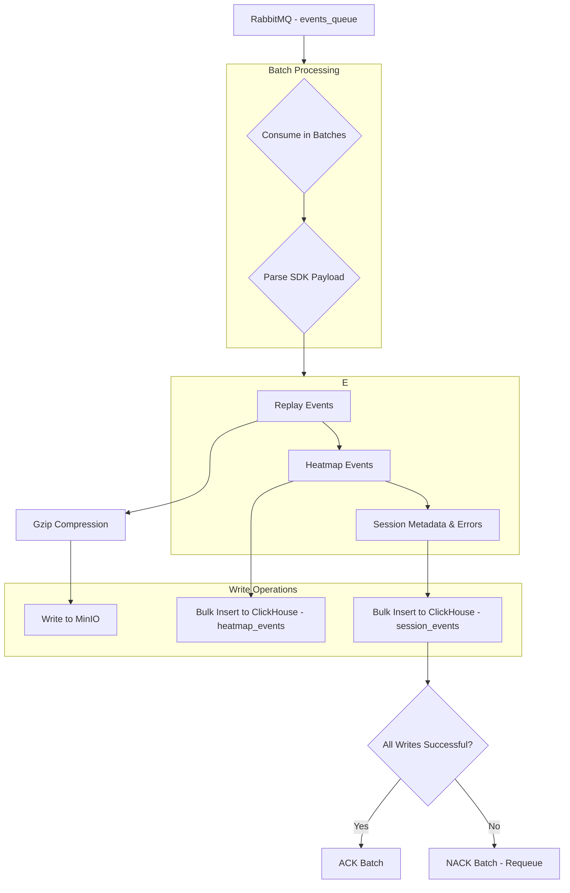

# Phase 4: The Processor Worker - Architecture

This document details the architecture and logic of the `processor-worker`, the core service responsible for asynchronously processing and storing all data collected by InsightCore.

## Mission of the Processor Worker

The worker's primary mission is to consume the raw data payloads from the `events_queue` in RabbitMQ, process them efficiently in batches, and distribute the parsed data to the appropriate long-term storage systems: MinIO, ClickHouse, and PostgreSQL.

This decouples data ingestion from data processing, ensuring the collection endpoint remains fast and responsive while allowing the worker to handle data with a focus on reliability and throughput.

## Data Flow Diagram

## Key Architectural Decisions

### 1. Batch Processing

To achieve high throughput, the worker does not process messages one by one. Instead, it buffers messages and processes them in batches.

-   **Batch Size:** A batch is processed when the buffer reaches **100 messages**.
-   **Batch Timeout:** A batch is also processed if **5 seconds** have passed since the first message in the buffer arrived.

This strategy reduces the number of database transactions and network round-trips, significantly improving overall efficiency.

### 2. Manual Acknowledgment (`noAck: false`)

The worker uses manual acknowledgment mode with RabbitMQ. This is critical for data reliability.

-   **ACK (Acknowledge):** If a batch is successfully written to MinIO and ClickHouse, the worker sends an `ack` for every message in that batch. This tells RabbitMQ to safely delete them from the queue.
-   **NACK (Negative Acknowledge):** If any error occurs during the processing of a batch (e.g., a database is temporarily unavailable), the worker sends a `nack` for all messages in the batch with the `requeue` flag set to `true`. This returns the messages to the queue to be processed again later, preventing data loss.

### 3. Data Distribution Logic

After parsing the batched SDK payloads, the worker segregates the data:

-   **Replay Data (`replayEvents`):** The raw `rrweb` event arrays are concatenated, compressed using **Gzip**, and stored as a `.json.gz` file in the MinIO object storage. The path is structured for multi-tenancy: `[project_id]/[session_id]/[timestamp].json.gz`.

-   **Heatmap Data (`heatmapEvents`):** Click and throttled mouse movement events are transformed into the required schema and bulk-inserted into the `heatmap_events` table in ClickHouse.

-   **Session Metadata (`session_events`):** High-level information about the session (e.g., start time, browser, OS, `has_errors` flag) is extracted from the events and inserted into the `session_events` table in ClickHouse. Storing this analytical metadata in ClickHouse allows for extremely fast querying and filtering on the dashboard.

This concludes the architectural overview of the Phase 4 Processor Worker. It is designed to be a robust, scalable, and reliable component of the InsightCore data pipeline.
